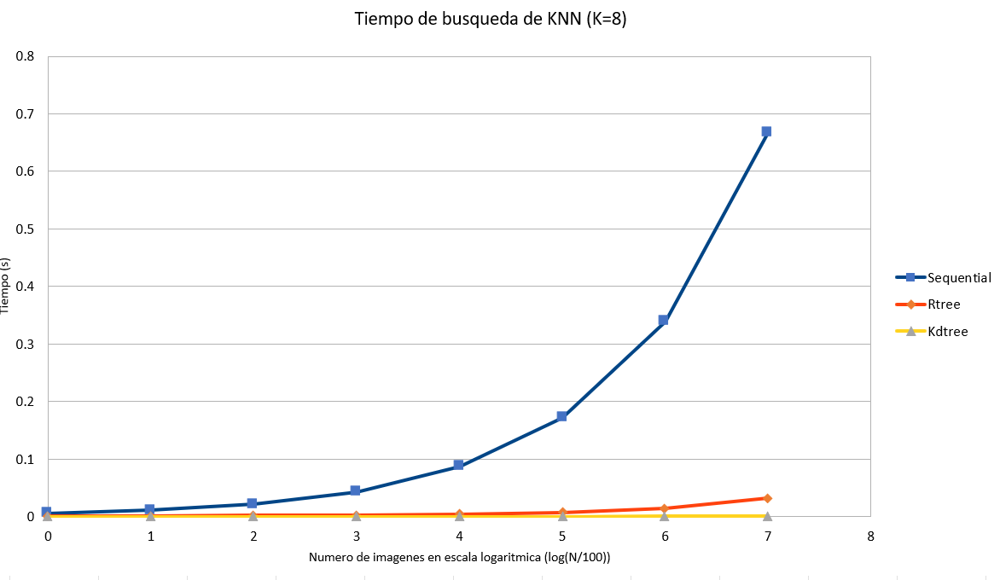

## BD3 - Grupo 4

**_Integrantes:_**

- Salazar Alva, Rodrigo Gabriel
- Sara Junco, Juan Sebastian 
- Ponce Contreras, Luis Eduardo
- Lapa Carhuamaca, Arleth Ivhy

**CUADRO DE ACTIVIDADES**

|    NOMBRE         |  ACTIVIDAD |
| ----------- | ----------------- |
| Rodrigo Salazar     | Implementación KNN-Sequential y KNN-Rtree               |
| Juan Sara              | Implementación KNN-HighD          |
| Luis Ponce             | Implementación Frontend y Cloud    |
| Arleth Lapa            | Implementacion Backend y Experimentación |
---
# Proyecto 3 | Bases de Datos Multimedia

## Introducción

El objetivo de este proyecto es aplicar algoritmos de búsqueda y recuperación de la información eficiente de imágenes, para ello se implementa un servicio web de reconocimiento facial para personas a partir de una colección grande de imágenes de rostros humanos. El proceso de generar dicha aplicación  contempla tres pasos, los cuales son: Extracción de características, Indexación de vectores característicos para búsquedas eficientes y aplicación del algoritmo de búsqueda KNN.  Estos procedimientos forman el backend, mientras que, para una interacción con los usuarios se realizó el frontend, en el cual puede realizar una consulta con una foto externa y retorna el top-k de las imágenes más parecidas.

## Implementación

### Librerías utilizadas

Face Recognition: Se realiza el uso de las funciones face_encodings y face_distance.
Rtree: Métodos de indexación espacial para Python.

### Dataset
Se usará una colección de 13 mil imágenes de rostros de personas aproximadamente extraídas de Labeled Faces in the Wild.

### Construccion del indice Rtree
Para construir el índice Rtree, se usó la librería Rtree de python para aplicar los métodos de indexación para los vectores característicos.

### Algoritmo de búsqueda KNN

#### KNN-Secuencial
La búsqueda del algoritmo de KNN, se usa un priority queue y retorna los K vecinos más cercanos al query. El procedimiento es el siguiente: se indexa las caras conocidas hasta "n" y llevamos un contador. Una vez que hemos llegado a "n", cerramos la indexación en memoria y se pasa esta información en un bucle for a la función de la librería Face Recognition face_distance. Agregaremos las distancias correspondientes a una estructura heap queue, con la cual finalmente retornaremos los K resultados más cercanos a nuestra query. Lo más notorio al realizar la búsqueda secuencial de esta manera, es que la gran mayoría del tiempo utilizado es la primera parte, indexar. Calcular, guardar y retornar los resultados resulta mucho más rápido, como se podrá apreciar en la experimentación realizada.

```js
def KNNSearch(self,q,k):
      tiebreaker = count() # Avoid numpy error from equal vectors
      result = []
      for (filename, imgvec) in self.read_seqfile():
           dist = - get_image_distance(q,imgvec) # Dist negativa para convertir min heap a max heap
           if (len(result) < k):
               heapq.heappush(result, (dist, next(tiebreaker), (filename, imgvec)))
           else:
                current_max = result[0]
                if (current_max[0] < dist):
                    heapq.heappop(result)
                    heapq.heappush(result, (dist, next(tiebreaker), (filename, imgvec)))
      result = [(tup[2], - tup[0]) for tup in result]
      result.sort(key=lambda tup : tup[1])
      return result

def RangeSearch(self,q,radius):
      result = []
      for (filename, imgvec) in self.read_seqfile():
           dist = get_image_distance(q,imgvec) # Dist negativa para convertir min heap a max heap
           if (dist <= radius):
               result.append( ((filename, imgvec), dist) )
      result.sort(key=lambda tup : tup[1])
      return result
```

#### KNN-Rtree
En primer lugar, se usa el índice Rtree guardado, y se asignan los valores necesarios correspondientes. Luego se realiza el encoder de la query a procesar Finalmente, para cada elemento en la lista del query (ya que es posible que existan varias caras), se agrega a la variable que recibe la función de la librería Rtree.
La búsqueda por rango en el RTree requiere de dos puntos que representan un MBR, y retorna los puntos que se encuentren en él. Para adaptarlo a nuestra implementación, debemos crear este MBR a partir del vector característico de búsqueda, sumando y restando el radio a sus 128 dimensiones. Luego, cuando retorne los resultados, debemos descartar los que se encuentren fuera del radio de cobertura, además de ordenar por distancia ya que no los trae ordenados.

```js
def KNNSearch(self,q,k):
      result = self.ind.nearest(q, num_results=k, objects=True)
      result = [((item.object, item.bbox[0:128]),ED(np.array(q), np.array(item.bbox[0:128]))) for item in result]
      result.sort(key=lambda tup : tup[1])
      return result

def RangeSearch(self,q,radius):
      result = []
      bottom = [i - radius for i in q]
      top    = [i + radius for i in q]
      MBB    = bottom+top

      upperbound = self.ind.intersection( tuple(MBB), objects=True )
      for item in upperbound:
           mbb = item.bbox[0:128]
           dist = ED(np.array(q), np.array(mbb))
           if ( dist <= radius):
               result.append(((item.object, mbb), dist))
      
      result.sort(key=lambda tup : tup[1])
      return result
```

#### KNN-HighD
La búsqueda por rango realiza una comparación de todos los datos de la colección de imágenes con la query, donde se retorna las imágenes que se encuentren dentro del radio de búsqueda con una complejidad O(n*d). Para esta implementación, se ha utilizado la estructura del KDTree, la cual consiste en ser una estructura de datos espacial para organizar ciertos puntos en un espacio de K - Dimensiones. Precisamente utilizamos esta estructura, ya que sus propiedades son óptimas para realizar una búsqueda de clave multidimensional, ya sea una búsqueda por rango o una búsqueda de vecinos más cercanos y a su vez este crea una gran nube de puntos. Para este caso, explicaremos el paso a paso de como funciona el algoritmo de búsqueda KNN en el KDTree. En primer lugar, debemos entender que cada nivel del KDTree tiene un eje que representa a los nodos, por ejemplo la raíz representa la partición en el eje X y sus hijos representan la partición en el eje Y. Dicha propiedad será aprovechada para el desarrollo de este algoritmo. Ahora, este algoritmo se ejecuta desde la raíz del árbol, básicamente se mueve recursivamente hacia abajo del árbol, simulando la inserción de un punto en el KDTree. Una vez que se llega un nodo hoja, este se verifica con respecto a su distancia hacia la query y la "mejor distancia actual", si este es menor se actualiza la mejor distancia con la del nodo hoja, caso contrario se sigue evaluando. Sin embargo, este algoritmo no solo se enfoca en evaluar el cuadrante en donde se encuentra la query, sino que este puede evaluar otras particiones del cuadrante contrario y conforme sea la distancia de la query con las regiones o sus puntos, se evaluará si se actualiza la mejor distancia. De esta forma, conseguimos los K vecinos más cercanos.

```js
def KNN_search_arbolito(self,point,k_n):
      distance, index = self.kd_tree.query(point,k=k_n) #Devuelve dos resultados, un arreglo de distancias y una arreglo de indices
      arreglo_resultados = {}
      arreglo_nombre_resultado = []
      for indice in index:
           arreglo_resultados[self.arreglo_nombres[indice]] = self.arreglo_datos[indice]
           arreglo_nombre_resultado.append(self.arreglo_nombres[indice])
      return arreglo_resultados, arreglo_nombre_resultado
```

#### Range Search HighD
La búsqueda por rango en un KDTree es muy particular, ya que esta aprovecha las propiedades dimensionales de la estructura. Por ende, este algoritmo se realizará primero tomando la región que empieza desde la raíz y verificar si esta intersecta con el rango de evaluación, si la respuesta es afirmativa, entonces se procede a acceder a sus hijos, las cuales tendrán una región diferente de partición y de nuevo se verificará si alguno de sus hijos intersecta con el rango, de no ser posible con uno de sus hijos, ya no se sigue bajando con ese respectivo nodo. El objetivo de este algoritmo, es poder llegar a las hojas en donde se encontrarán los puntos de evaluación y poder obtener los que se encuentran dentro del rango a través de verificaciones con sus regiones de partición.

```js
def range_search_arbolito(self,point,r):
      result = sorted(self.kd_tree.query_ball_point(point,r)) #Devuelve un arreglo de indices con los resultados
      resultado_puntos = {} #Si point es un arreglo de un unico punto, entonces devuelve un arreglo de indices
      resultado_nombres = []
      for indice in result: #Si point es un arreglo de varios puntos, entonces devuelve varios puntos con respecto al radio
           resultado_puntos[self.arreglo_nombres[indice]] = self.arreglo_datos[indice]
           resultado_nombres.append(self.arreglo_nombres[indice])
      return resultado_puntos, resultado_nombres
```

### Análisis de la maldición de la dimensionalidad 

Dentro de Machine Learning a medida que se tiene un conjunto de datos con muchas dimensiones, es decir datos con múltiples características provoca dos principales errores, estos son:
La distancia entre los datos aumenta cuando el número de dimensiones aumenta. 
La variabilidad disminuye exponencialmente con el número de dimensiones.

Para esto, existen algunas soluciones óptimas para poder afrontar esta problemática, estas son las siguientes: 
Reducir o disminuir el número de dimensiones.
Aumentar el número de datos.

#### Técnicas de reducción de dimensionalidad

##### Principal Component Analysis (PCA) 

Consiste en mantener solo las características dimensionales que tienen la mayor parte de la varianza y descartar las dimensiones que contienen una varianza casi nula, capturando de esta manera la dirección de máxima varianza, dándose así esta reducción de dimensionalidad de las características de datos. Devuelve P componentes principales en un rango de 1 a N características originales, ordenadas en base a  cuáles características representan mayor varianza.
  
##### Linear Discriminant Analysis (LDA) 
Consiste en explícitamente intentar modelar la diferencia entre las clases de datos. Cada componente busca maximizar la separabilidad entre las diferentes clases, minimizando a su vez la distancia entre elementos de una misma clase. Devuelve L ejes en un rango de 1 a C-1 clases, ordenadas en base a cuanta separabilidad representan.
   

## Experimentación

Se realizaron 3 pruebas, cada una con un respectivo algoritmo KNN-RTree, KNN-secuencial y el KNN-HighD sobre una colección de objetos de tamaño N y el valor constante de k = 8. Se comparó los resultados en la siguiente tabla:


|     N     | KNN-Secuencial      | KNN-RTree           | KNN-HighD            |
|-----------|---------------------|---------------------|----------------------|
| N = 100   | 0.00567150115966797 | 0.00113177299499512 | 0.000110864639282227 |
| N = 200   | 0.0111401081085205  | 0.00138974189758301 | 0.00011444091796875  |
| N = 400   | 0.0216867923736572  | 0.00223731994628906 | 0.000135898590087891 |
| N = 800   | 0.0427703857421875  | 0.00290298461914062 | 0.000157356262207031 |
| N = 1600  | 0.0878100395202637  | 0.0038764476776123  | 0.000223636627197266 |
| N = 3200  | 0.171669721603394   | 0.00756597518920898 | 0.000354528427124023 |
| N = 6400  | 0.339271306991577   | 0.0150580406188965  | 0.000608682632446289 |
| N = 12800 | 0.666930675506592   | 0.0322513580322266  | 0.00148487091064453  |


 imágenes")
Los resultados expuestos en la grafica 1 nos muestran la diferencia en realizar la busqueda de los K vecinos mas cercanos utilizando las tres tecnicas implementadas. Como se puede observar, el algoritmo secuencial tiene una complejidad lineal con crecimiento de mayor rapidez que los metodos indexados por ordenes de magnitud (1 orden con RTree y 2 con HighD).

Si bien los algoritmos de RTree y HighD tienen resultados comparables, HighD tiene un mejor rendimiento en general que se hace mas evidente a medida que incrementa el numero de elementos en la estructura.


La grafica 2 nos muestra los mismos resultados pero expuestos en una escala logaritmica. De esta forma, podemos apreciar mejor las diferencias expuestas previamente: HighD tiene la mejor peformance, seguido de RTree que tiene resultados comparables hasta que se llega a elevados valores de N donde se hace mas evidente la diferencia y por ultimo el secuencial que, al tener que recorrer todos los elementos, tiene una complejidad elevada y de crecimiento lineal. Cabe destacar sin embargo que, como el KDTree esta en memoria principal mientras que el RTree se encuentra en memoria secundaria, esta resulta una comparación un poco injusta. Ello se podria solucionar extendiendo la implementación del KDtree para trabajar sobre memoria secundaria, adicionalmente que incrementaria su escalabilidad.

#### Aplicación web

### Telegram
Se implementó un bot en Telegram que se conecta a la base de datos para obtener los resultados de las queries. En este caso se le envía una imágen y el algoritmo a usar, y el bot en respuesta nos da los K rostros más parecidos y nos envía estas imágenes, siendo una por mensaje. Cabe recalcar que la implementación en python 
se encuentra en google cloud.


